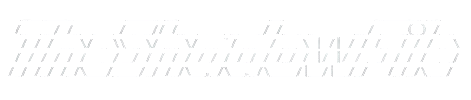

<div align="center">
  
  <p>Hide and extract secret text messages within image files.<br>Written in Python/FastAPI</p>
</div>

## Usage

### Install uv

```bash
cd path/to/root/directory
pip install uv
```

### Option A: Web API Server

```bash
uv run fastapi dev main.py
```

Access web app at `http://127.0.0.1:8000` or `http://localhost:8000`.

### Option B: CLI

```bash
uv run cli.py
```

## Demo Images


## Disclaimer

**TheShadowFile** is designed for **educational purposes** and authorized testing only.
You must only use this tool on systems and files you own or have explicit permission to test.
The authors are **NOT** responsible for any misuse, damage, or legal consequences resulting from this tool.
